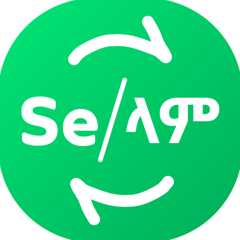
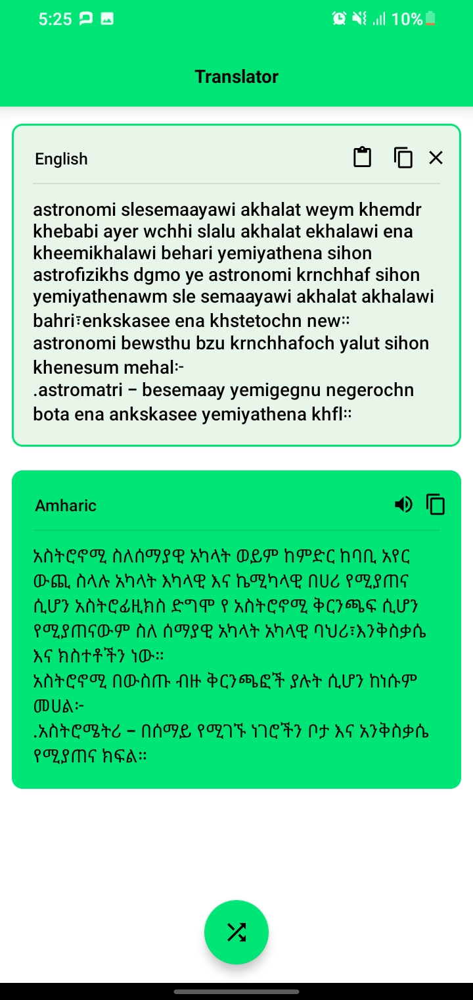

<center>

</center>

# En-Am Translator : Selam -> ሰላም

This project is just Translator Amharic written in English to real Amharic characters. like

Selam <-> ሰላም

It doesn't use any AI model or module like tensorflow or something, just with simple class it is been translated instantly. But it can be more powerful if AI is implmented on it indeed.

If you know how, and want to contribute, just do that, who knows this might be the project you was looking for to learn & practice a lot more.

## Screenshot
<center>

</center>

You can try the debug app, it is in the zip file.

## Features

* Translate En-Am to Am and vice versa
* With just modern UI & UX
* With everything you are expecting ;)

## Sample code

```java
textview2.setText(Translator.getTranslated(MainActivity.this, edittext1.getText().toString()));
```

## Compatibility

Requires at least Android 5.0 Lollipop on your device. The app will work properly on devices without any Google service installed.

## License

```
The MIT License (MIT)

Copyright (c) 2024 AbrishPhoenix

Permission is hereby granted, free of charge, to any person obtaining a copy
of this software and associated documentation files (the "Software"), to deal
in the Software without restriction, including without limitation the rights
to use, copy, modify, merge, publish, distribute, sublicense, and/or sell
copies of the Software, and to permit persons to whom the Software is
furnished to do so, subject to the following conditions:

The above copyright notice and this permission notice shall be included in all
copies or substantial portions of the Software.

THE SOFTWARE IS PROVIDED "AS IS", WITHOUT WARRANTY OF ANY KIND, EXPRESS OR

IMPLIED, INCLUDING BUT NOT LIMITED TO THE WARRANTIES OF MERCHANTABILITY,
FITNESS FOR A PARTICULAR PURPOSE AND NONINFRINGEMENT. IN NO EVENT SHALL THE
AUTHORS OR COPYRIGHT HOLDERS BE LIABLE FOR ANY CLAIM, DAMAGES OR OTHER
LIABILITY, WHETHER IN AN ACTION OF CONTRACT, TORT OR OTHERWISE, ARISING FROM,
OUT OF OR IN CONNECTION WITH THE SOFTWARE OR THE USE OR OTHER DEALINGS IN THE
SOFTWARE.
```

By @AbrishPhoenix